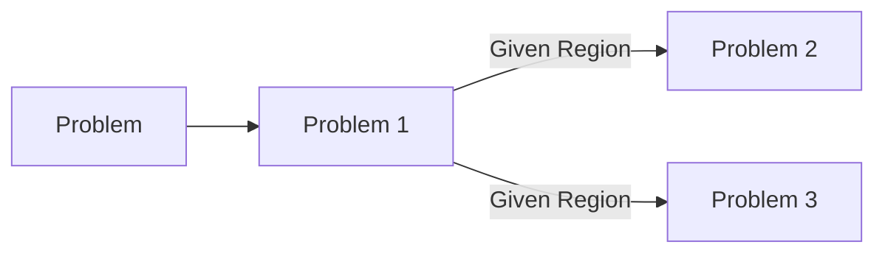

## Problem Formulation
In this section, we will formulate the problem of verifying the safety of a neural network controller for a nonlinear control system. We will first introduce the problem setup and then separate the problem into two major parts, courser search and finer verification. Courser search explores the region of interest and finer verification verifies the safety of the neural network controller within the region of interest.

### Separation of the Problem
Consider a nonlinear continuous-time control system with dynamics model formulated as 
$$\dot{x}(t) = f(x(t)) + g(x(t))u(t)$$ 
where $f: \mathbb{R}^{n} \rightarrow \mathbb{R}^{n}$ and $g: \mathbb{R}^{n} \rightarrow \mathbb{R}^{n \times m}$ are known continuous functions. We assume that the system is required to satisfy a safety constraint of the form $x(t) \in \mathcal{C}$ for all time $t \geq t_{0}$, where $\mathcal{C}$ is a safe region defined by $\mathcal{C} = \{x : h(x) \geq 0\}$ for some known continuous function $h: \mathbb{R}^{n} \rightarrow \mathbb{R}$. In what follows, we let $co(\mathcal{X})$ denote the convex hull of a set $\mathcal{X}$. 

**Problem:**
Given a nonlinear continuous-time system, a neural network function $b: \mathcal{X} \rightarrow \mathbb{R}$, a set of admissible control inputs $\mathcal{U} = \{u: Au \leq c\}$ for given matrix $A \in \mathbb{R}^{p \times m}$ and vector $c \in \mathbb{R}^{p}$, and a safe set $\mathcal{C} = \{x: h(x) \geq 0\}$, determine whether 
1. $\mathcal{D} \subseteq \mathcal{C}$
2. there exists a control policy $\mu$ such that $\mathcal{D}$ is positive invariant  under dynamics and control policy $\mu$. 

We separate the problem into two major parts:
1. We conduct courser-to-finer search to find the region of interest. The region of interest is defined as the region where the neural network controller is potentially unsafe. Specifically, for control barrier certificate the system is unsafe if $B(x)=0$ and $\frac{\partial B}{\partial x}f(x)+\frac{\partial B}{\partial x}g(x)\pi(x)<0$; for control barrier fucntion the system is unsafe if $B(x)=0$ and $\frac{\partial B}{\partial x}g(x)u=0$. We can conduct courser search by INVPROP. INVPROP is a over-approximation algorithm that can be used to those constraints within a certain the region $\epsilon_B$, $\epsilon_f$ and $\epsilon_g$, respectively. 
2. For barrier certificate the system is unsafe if $B(x)\in[-\epsilon_B,\epsilon_B]$ and $\frac{\partial B}{\partial x}f(x)<-\epsilon_f$; for control barrier fucntion the system is unsafe if $B(x)\in[-\epsilon_B,\epsilon_B]$, $\frac{\partial B}{\partial x}f(x)<-\epsilon_f$ and $\frac{\partial B}{\partial x}g(x)u\in[-\epsilon_g,\epsilon_g]$. We can conduct finer search by BaB based on CROWN-IBP to find exact activation function for each ReLU neuron. In this problem we need to formulate the problem into a linear programming problem or a ReLUplex problem.  
3. Similar to 2. we can conduct finer search by BaB based on CROWN-IBP to find exact activation function for each ReLU neuron. In this problem we need to formulate the problem into a dReal problem. 

### Problem 1 Statement

**Problem 1:** Given a nonlinear continuous-time system, a neural network function $b: \mathcal{X} \rightarrow \mathbb{R}$, a set of admissible control inputs $\mathcal{U} = \{u: Au \leq c\}$ for given matrix $A \in \mathbb{R}^{p \times m}$ and vector $c \in \mathbb{R}^{p}$, and a safe set $\mathcal{C} = \{x: h(x) \geq 0\}$, find the region of interest, i.e., $\mathcal{Z}_B:=\{x:B(x)\in [-\epsilon_B, \epsilon_B]\}$, $\mathcal{Z}_f:=\{x:\frac{\partial B}{\partial x}f(x)<-\epsilon_f\}$ and $\mathcal{Z}_g:=\{x:\frac{\partial B}{\partial x}g(x)\in [-\epsilon_g, \epsilon_g]\}$ 

We can use the idea from [Provably Bounding Neural Nework](https://arxiv.org/pdf/2302.01404v2.pdf) to conduct courser search. The INVPROP algorithm, as described in the research by Suhas Kotha et al., primarily focuses on linear constraints in neural network verification. While the algorithm is innovative in handling the inverse problem of over-approximating input sets for given outputs, its core methodology is designed around linearly constrained output sets of neural networks. The idea is to propose a scheme to transform the nonlinear programming problem into a linear formulation that can be solved efficiently by INVPROP.

For barrier certificate the system is unsafe if $B(x)\in[-\epsilon_B,\epsilon_B]$ and $\frac{\partial B}{\partial x}f(x)<-\epsilon_f$; for control barrier fucntion the system is unsafe if $B(x)\in[-\epsilon_B,\epsilon_B]$, $\frac{\partial B}{\partial x}f(x)<-\epsilon_f$ and $\frac{\partial B}{\partial x}g(x)u\in[-\epsilon_g,\epsilon_g]$.

### Problem 2 Statement

**Problem 2:** Given regions $\mathcal{Z}_B\cap\mathcal{Z}_f\cap\mathcal{Z}_g$, determine whether a ReLU neural network controller is safe, i.e.,
1. $\mathcal{D} \subseteq \mathcal{C}$
2. there exists a control policy $\mu$ such that $\mathcal{D}$ is positive invariant  under dynamics and control policy $\mu$. 

### Problem 3 Statement

**Problem 3:** Given regions $\mathcal{Z}_B\cap\mathcal{Z}_f\cap\mathcal{Z}_g$, determine whether a tanh and sigmoid neural network controller is safe, i.e.,
1. $\mathcal{D} \subseteq \mathcal{C}$
2. there exists a control policy $\mu$ such that $\mathcal{D}$ is positive invariant  under dynamics and control policy $\mu$. 
## Timeline
- [ ] 01/15-01/22: Read LiRPA related papers and try INVPROP to explore the region of interest. 
- [ ] 01/22-01/29: Read BaB related papers and try BaB to verify the safety of a ReLU neural network CBF for a linear control system.
- [ ] 02/01-02/08: Read dReal to see how to formulate the nonlinear programming problem into a dReal problem.
- [ ] 02/09-02/20: Read BaB related papers and try BaB to verify the safety of a Tanh and sigmoid neural network CBF for a nonlinear control system.